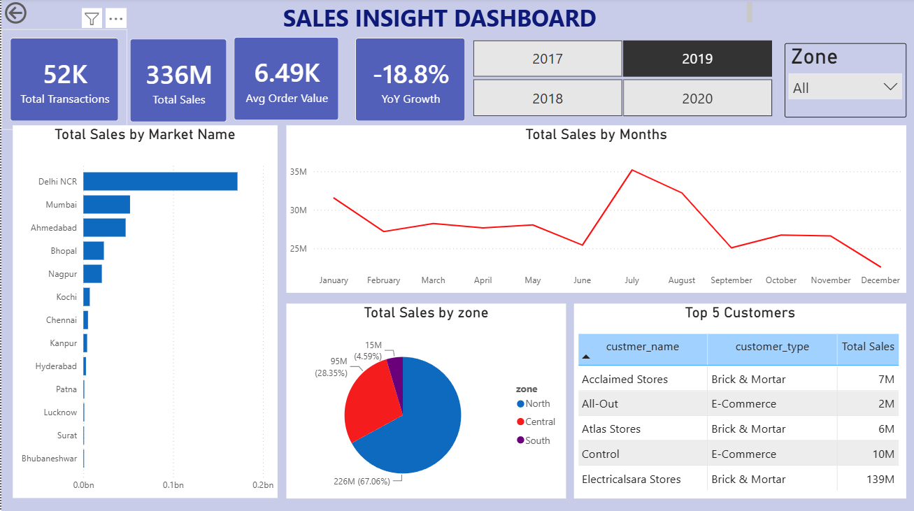

# 📊 Sales Insight Dashboard

An interactive **Power BI sales analytics dashboard** that transforms raw sales transactions into a decision-ready view of performance across **time, markets, zones, products, and customers**.

> **Project note:** This is a hands-on learning and portfolio project based on the structure of a Codebasics Power BI beginner tutorial. The data preparation, cleaning, currency normalization, data modeling, DAX measures, and dashboard implementation reflect my own work.

---

## 🖼️ Dashboard Preview



---

## ⚡ Key Metrics

| Metric              |      Value |
| ------------------- | ---------: |
| Total Transactions  |    **52K** |
| Total Sales         |  **₹336M** |
| Average Order Value | **₹6.49K** |
| YoY Growth          | **-18.8%** |

> Values reflect the selected year and zone filters and update dynamically within the report.

---

## 🎯 Business Questions

The dashboard is designed to answer key sales-performance questions:

* How much are we selling, and how many transactions drive that sales?
* How is sales performance changing over time?
* Which markets and zones contribute the most to sales?
* Who are the top customers?
* How is average order value changing?

---

## 🔄 Project Workflow

**Raw Sales Data → Data Cleaning → Currency Normalization → Data Modeling → DAX Measures → Power BI Dashboard → Validation**

---

## 🧹 Data Cleaning & Transformation

The raw data required several preparation steps before analysis:

* Removed records with **blank zones**.
* Excluded invalid `sales_amount` values of **0 and -1**.
* Used `Trim` and `Clean` to standardize inconsistent currency values.
* Created a `norm_sales_amount` column to convert **USD transactions to INR using × 95.39**, while retaining INR transactions as they were.
* Converted the normalized sales column to a numeric data type.

---

## 🧩 Data Model

The dashboard uses a **star-schema-style model** consisting of one fact table and supporting dimension tables.

| Table                | Role                             |
| -------------------- | -------------------------------- |
| `sales transactions` | Transaction-level sales data     |
| `sales customers`    | Customer information             |
| `sales products`     | Product information              |
| `sales markets`      | Market and zone information      |
| `sales date`         | Calendar table for time analysis |

Relationships are built through customer, product, market, and date keys to support consistent filtering across the dashboard.

---

## 🧮 DAX Measures

Key measures created for the dashboard include:

```DAX
Total Sales = SUM('sales transactions'[norm_sales_amount])

Total Transactions = COUNTROWS('sales transactions')

Total Sales PY =
CALCULATE(
    [Total Sales],
    SAMEPERIODLASTYEAR('sales date'[date])
)

Avg Order Value =
DIVIDE([Total Sales], [Total Transactions])

YoY Growth =
DIVIDE(
    [Total Sales] - [Total Sales PY],
    [Total Sales PY]
)
```

---

## 📈 Dashboard Features

* **KPI Cards** — Total Sales, Total Transactions, Average Order Value, YoY Growth
* **Interactive Filters** — Year and Zone
* **Sales Analysis** — Market, Zone, and Monthly Sales
* **Customer Analysis** — Top 5 Customers
* **Time Analysis** — Monthly sales trends

All visuals respond dynamically to the selected filters.

---

## ✅ Validation

The Power BI results were cross-checked against the source data using **MySQL Workbench**, including transaction counts, invalid sales values, and aggregate sales totals.

---

## 📁 Repository Structure

```text
sales-insight-dashboard/
│
├── README.md
│
├── powerbi/
│   └── Sales_Insight_Dashboard.pbix
│
├── screenshots/
│   └── dashboard.png
│
└── .gitignore
```

---

## 🚀 Future Improvements

* Add sales quantity and profit KPIs
* Add drill-through pages for markets and customers
* Add dynamic filter-aware KPI titles
* Add rolling averages and additional time-intelligence measures
* Implement scheduled data refresh

---

## 👤 Author

**Vaishnavi Phadatare**
